I'm impatient and thrilled to introduce [seel][1], a command-line tool to containerize your **Node.js** application without effort. Not all developers are Docker/container experts and containerizing an application is not a simple task. For example, you will have to:

- Write a [Dockerfile][3]
- Follow the security best practices
- Build the smallest image possible
- Optimize the Docker build cache
- Define a tagging strategy (e.g. [semantic versioning][2], git commit hash)
- Write and maintain build and publish scripts

## Focus on your application, seel takes care of the containerization

To simplify this **seel** uses opinionated, but configurable, defaults based on the properties defined in the application `package.json` (e.g. name, version, bin/main scripts, description, ...).

The following screencast shows the containerization of an application created from scratch with `npm` (more examples are available [here](https://github.com/kevinpollet/seel#examples)).

## Some features

- Tree shaking, only the entry module dependencies are packaged
- Automatic image tagging with [semantic versioning][2]
- Automatic image labelling (description, maintainer, version)
- Secure private package registry configuration
- Optimized Docker build cache

## What's next?

**seel** is actively developed and at its early stages. If you want to test it, file bugs, request a feature or contribute some code, go to the [GitHub repository][1] and don't miss to give some 💚 and support with a ⭐.

[1]: https://github.com/kevinpollet/seel
[2]: https://semver.org/
[3]: https://docs.docker.com/engine/reference/builder/
